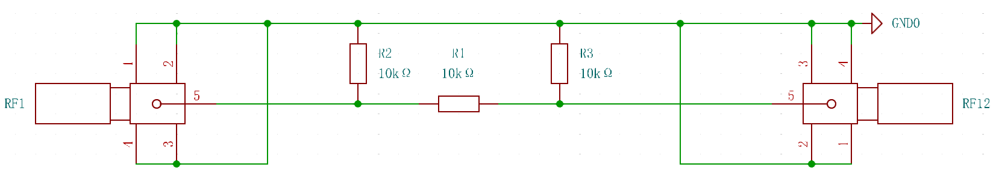
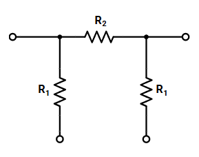
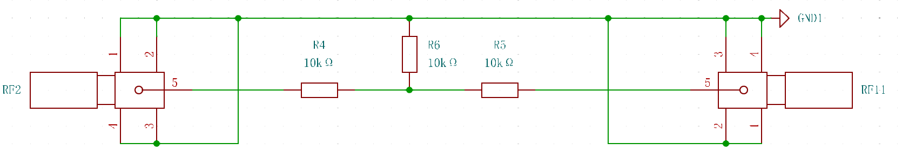
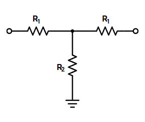
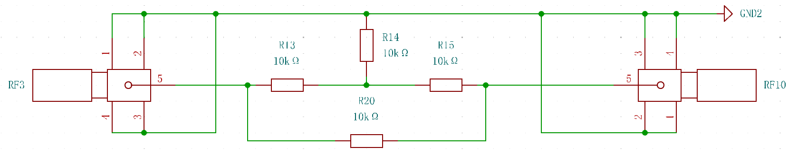
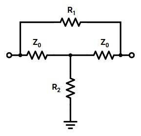
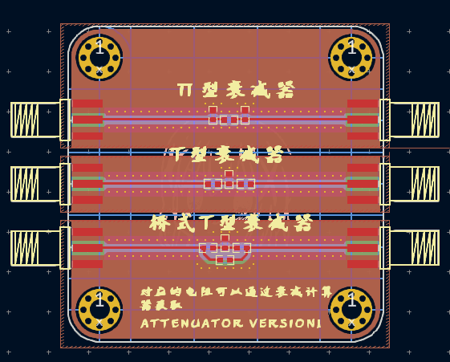
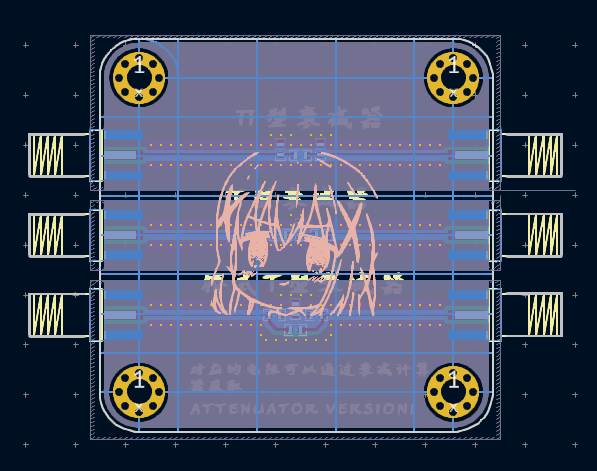

<h1>Attenuator 衰减器模块</h1>

衰减器是一种用于降低信号幅度而不引入明显失真的无源网络，广泛应用于射频、音频和测量系统中。根据电路拓扑结构，常见衰减器包括**PI型**、**T型**和**桥式T型**。本模块采用标准50Ω特性阻抗设计，支持用户通过外部电阻灵活配置衰减值。

---

### PI型衰减器

图1-1 PI型衰减器原理图

PI型衰减器由两个并联电阻和一个串联电阻构成“π”形结构，具有对称性好、频响平坦的特点。其电阻值计算公式如下：

$$
R_1 = Z_0 \left( \frac{10^{\frac{A_{dB}}{20}} + 1}{10^{\frac{A_{dB}}{20}} - 1} \right)\\

R_2 = \frac{Z_0}{2} \left( 10^{\frac{A_{dB}}{20}} - \frac{1}{10^{\frac{A_{dB}}{20}}} \right)
$$

图1-2 PI型衰减器电路图

---

### T型衰减器

图2 T型衰减器原理图

T型衰减器由两个串联电阻和一个并联电阻构成“T”形结构，适用于需要对称输入输出阻抗的场合。其电阻值计算公式如下：

$$
R_1 = Z_0 \left( \frac{10^{\frac{A_{dB}}{20}} - 1}{10^{\frac{A_{dB}}{20}} + 1} \right)\\
R_2 = 2Z_0 \left( \frac{10^{\frac{A_{dB}}{20}}}{10^{\frac{A_{dB}}{10}} - 1} \right)
$$

图2-2 T型衰减器原理图

---

### 桥式T型衰减器

图3 桥式T型衰减器原理图

桥式T型衰减器是一种改进结构，具有更好的频率响应和功率承受能力，适用于高频和功率衰减场合。其电阻值计算公式如下：

$$
R_1 = Z_0 \left( 10^{\frac{A_{dB}}{20}} - 1 \right)\\
R_2 = Z_0 \left( \frac{1}{10^{\frac{A_{dB}}{20}} - 1} \right)
$$

图3-2 桥式T型衰减器原理图

---

### PCB设计与尺寸

  
  

图4 Attenuator PCB设计

    
PCB尺寸示意图

    

      
50 × 50 mm

    

    
边长：50 mm

    
正方形 PCB

  

  

    
安装孔径

    
M3

  

  

    
安装孔数量

    
4个

  

  

    
板厚

    
1.6 mm

  

  

    
安装孔位置

    
四角对称

  

---

### 使用注意

- 选择电阻时需注意其功率承受能力与频率特性，建议使用薄膜电阻或高频专用电阻。
- 焊接时注意电阻布局对称，避免引入寄生参数影响高频性能。
- 使用M3铜柱与螺母固定PCB，确保机械稳固。
- 在高频或大功率应用时，注意散热与屏蔽。

---

### 附录：建议匹配电阻（Z₀=50Ω）

| 衰减量 (dB) | PI型衰减器         | T型衰减器          | 桥式T型衰减器     |
| ----------- | ------------------ | ------------------ | ----------------- |
| **3 dB**    | R₁=292Ω, R₂=17.6Ω  | R₁=8.55Ω, R₂=292Ω  | R₁=20.5Ω, R₂=121Ω |
| **6 dB**    | R₁=150Ω, R₂=37.4Ω  | R₁=16.6Ω, R₂=150Ω  | R₁=50Ω, R₂=50Ω    |
| **10 dB**   | R₁=96.2Ω, R₂=71.2Ω | R₁=25.9Ω, R₂=96.2Ω | R₁=107Ω, R₂=23.5Ω |
| **20 dB**   | R₁=61.1Ω, R₂=247Ω  | R₁=40.9Ω, R₂=61.1Ω | R₁=450Ω, R₂=5.56Ω |

> 注：电阻值为理论计算值，实际选型应选用最接近的标准阻值，并考虑电阻精度与温度系数。
