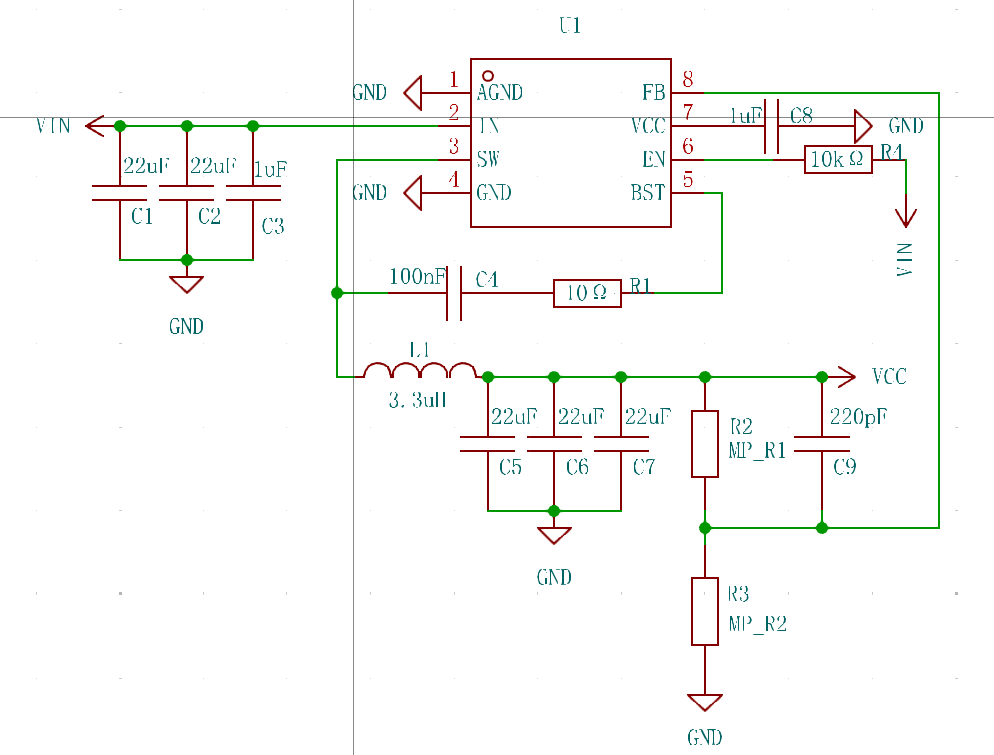
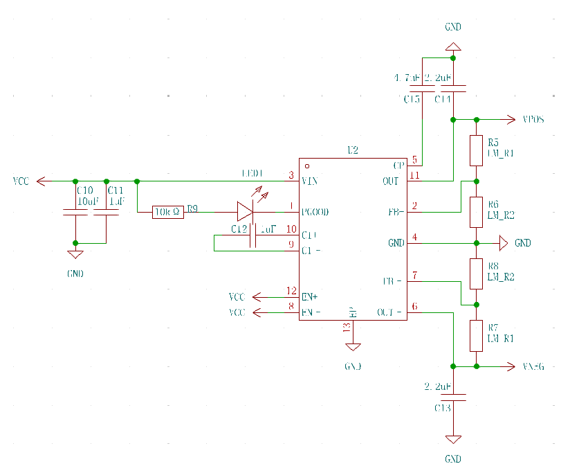
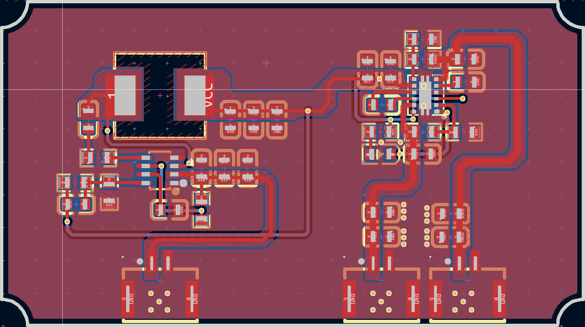
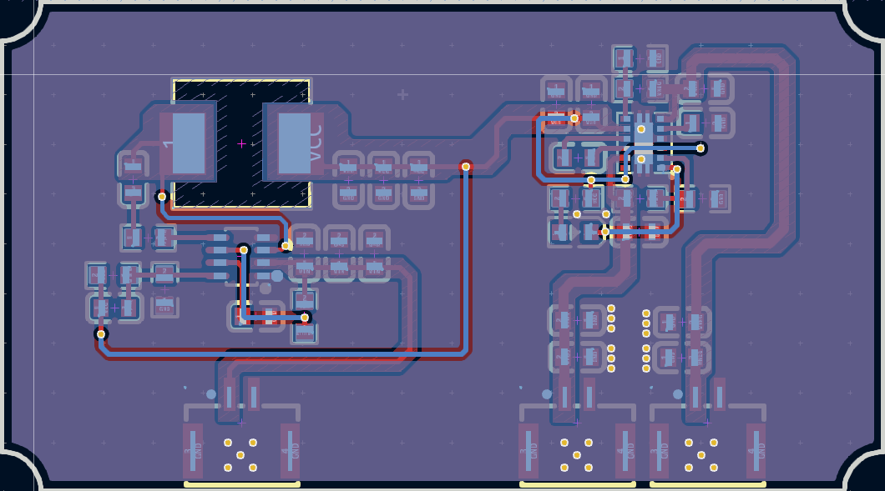

<h1>Dual-OutputLDO</h1>

LM27762 是一款低噪声正负输出集成式电荷泵与 LDO 芯片，能够从单路输入（2.7V‑5.5V）同时生成可调节的正电压（1.5V‑5V）和负电压（‑1.5V‑‑5V），输出电流可达 ±250mA。其特点包括采用反相电荷泵后接负 LDO 的结构，开关频率为 2MHz，输出噪声极低（典型值 22μVrms），并具有独立的使能控制和电源正常（PGOOD）指示功能。重要参数包括静态电流仅 390μA（典型值）、关断电流 0.5μA，正/负 LDO 在 100mA 负载下的压降分别为 45mV 和 30mV，适用于音频放大器、运放偏置、数据转换器等需要低噪声正负电源的场景。

MP2236 是一款 18V、6A 高效率同步降压转换器，采用恒定导通时间（COT）控制，提供快速瞬态响应和简易的环路补偿。其输入电压范围宽达 3V‑18V，支持最大 6A 连续输出电流，内部集成低导通电阻的功率 MOSFET（25mΩ/12mΩ）。该器件默认参考电压为 600mV，开关频率为 600kHz，并具备打嗝式过流保护（OCP）和热关断功能。重要参数包括轻载时静态电流 150μA（典型值）、关断电流低于 1μA，以及内部软启动时间约 1ms，主要应用于平板电视、数字电视电源、分布式电源系统等中高功率降压转换场合。

### 硬件设计

图1 MP2236模块

MP2236是一款同步降压（Step-Down）转换器，其核心任务是将较高的输入电压（如12V）高效、稳定地转换为一个更低的、可精确设定的中间电压（VCC）。这个电压的设定完全由一个连接在输出端与反馈（FB）引脚之间的外部电阻分压网络决定。计算遵循公式 **Vout = 0.6V × (1 + R1/R2)**，其中0.6V是芯片内部的精密基准电压。通过改变R1与R2的阻值比例，即可在0.6V至输入电压的范围内线性调节输出电压。MP2236采用恒定导通时间（COT）控制模式，能根据输入、输出电压实时调整开关频率，在宽输入范围内保持效率与快速瞬态响应。其输出的VCC电压的精度和稳定性，直接决定了后续电路供电平台的质量。

图2 LM27762模块

LM27762则是一个集成了电荷泵和低压差线性稳压器（LDO）的独特芯片，它能从一个单路正输入（即MP2236提供的VCC）同时产生一组相互独立、低噪声的正负输出电压（如+3.3V和-3.3V）。其每路输出都拥有独立的反馈控制环路：正输出由基准电压1.2V和电阻R1、R2设定（公式：**Vout+ = 1.2V × (R1+R2)/R2**），负输出则由基准电压-1.22V和电阻R3、R4设定（公式：**Vout- = -1.22V × (R3+R4)/R4**）。一个关键的设计约束是，为了保障LDO环路的稳定，连接到地的反馈电阻R2和R4必须不小于50kΩ。这种设计允许工程师灵活配置不对称的双电源（如+5V/-3V），但为了获得最佳性能，正负输出的电阻需分别计算以确保精度。

  
  

图3 Dual-OutputLDO PCB设计

PCB尺寸示意图

25 × 45 mm

长×宽 (单位: mm)，四角2mm半径内凹缺角

  

    

      
安装孔半径

      
2 mm

    

    

      
安装孔数量

      
4个

    

    

      
板厚

      
1.6 mm

    

    

      
安装孔位置

      
四角对称

    

### 使用注意

- 在焊接过程中需注意反馈电阻的选择,原理图上为标注电阻大小的作为反馈电阻,具体取值参考附录
- 在使用前尽可能先估算电压电流大小,该电路板不适合通过大电流
- 用户需要采用4个铜柱+螺母将PCB固定
- 由于可以同时输出正负电压,所以在使用过程中注意散热

### 附录:建议匹配电阻

| 目标输出 (LM27762) | 推荐VCC (MP2236) | MP2236 电阻配置 (产生VCC)         | LM27762 正输出电阻配置            | LM27762 负输出电阻配置            | 计算实际电压                                 |
| :----------------- | :--------------- | :-------------------------------- | :-------------------------------- | :-------------------------------- | :------------------------------------------- |
| **±3.3V**          | **4.0V**         | **R1**: 267kΩ  **R2**: 47.5kΩ | **R1**: 174kΩ  **R2**: 100kΩ  | **R3**: 169kΩ  **R4**: 100kΩ  | VCC≈3.99V  VOUT+≈3.30V  VOUT-≈-3.29V |
| **±1.8V**          | **2.5V**         | **R1**: 158kΩ  **R2**: 49.9kΩ | **R1**: 51.1kΩ  **R2**: 100kΩ | **R3**: 47.5kΩ  **R4**: 100kΩ | VCC≈2.50V  VOUT+≈1.81V  VOUT-≈-1.80V |
| **±2.5V**          | **3.3V**         | **R1**: 287kΩ  **R2**: 63.4kΩ | **R1**: 127kΩ  **R2**: 100kΩ  | **R3**: 124kΩ  **R4**: 100kΩ  | VCC≈3.30V  VOUT+≈2.51V  VOUT-≈-2.50V |
