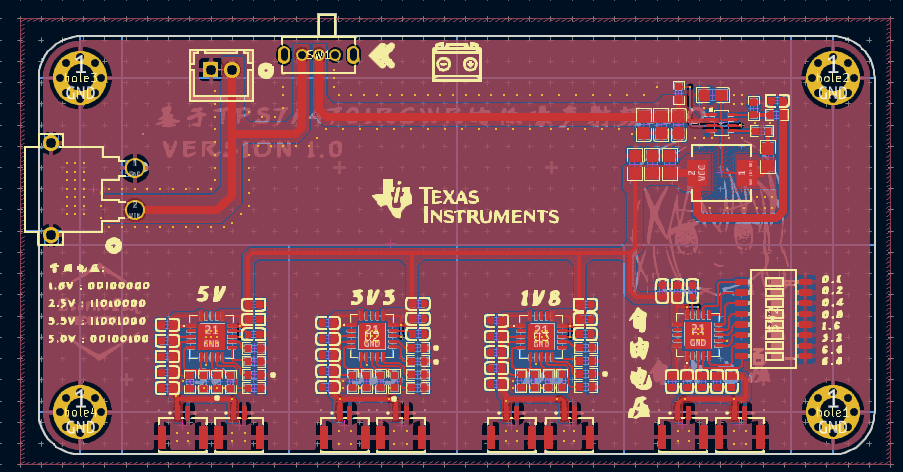
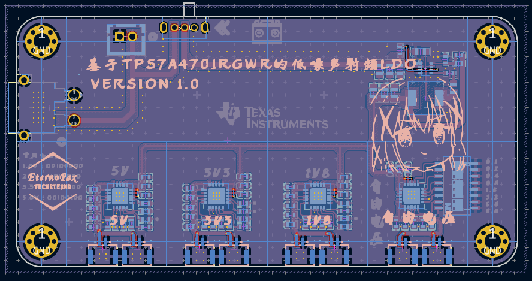

<h1>QuietLDO</h1>

**MP2236** 是一款由 MPS 生产的高效率同步降压转换器，其输入电压范围为 3V 至 18V，并能提供高达 6A 的连续输出电流。它采用恒定导通时间控制模式，具有快速的瞬态响应能力，开关频率为 600kHz，且集成了低导通电阻的功率 MOSFET，使其在宽负载范围内都能保持高效。该芯片内置了打嗝模式的过流保护、热关断和欠压锁定等全面保护功能，外围元件精简，采用紧凑的 TSOT23-8 封装，非常适用于平板显示器、数字电视电源和分布式电源系统等需要高电流密度和高效能的应用场景。

**TPS7A47** 系列是德州仪器推出的一款高压、超低噪声的 LDO 线性稳压器，包括 TPS7A4700 和 TPS7A4701 两个型号。它的输入电压范围宽达 3V 至 36V，输出电流为 1A，其最突出的特点是极低的输出噪声（仅 4µVrms）和极高的电源抑制比，能为核心模拟电路提供极其洁净的电压轨。TPS7A4700 可通过独特的 ANY-OUT 引脚编程方式设置输出电压（1.4V 至 20.5V），无需外部电阻；TPS7A4701 还支持通过外部电阻在更宽范围（至 34V）内调节。该器件采用带散热焊盘的 VQFN 封装，是射频电路、高精度 ADC/DAC、测试测量以及医疗音频等噪声敏感型应用的理想选择。

### 硬件设计

图1 TPS7A47模块

这一个基本的TPS7A47模块,在实际使用时,需要考虑右侧八个电阻的有无.在其配置中他有1.4V到20.5V的输出,步长为0.1V,计算公式如下:V_
$$
V_{out} = 1.4V + a_0V_{0.1} + a_1 V_{0.2}+ a_2 V_{0.4}+ a_3 V_{0.8}+ a_4 V_{1.6}+ a_5 V_{3.2}+ a_6 V_{6.4}+ a_7 V_{6.4}
$$
但实际上我们在实际需求时只需要6V以下的电压,过大的电压在实际中并不适合LDO,超过7V的输入在实际使用中会使得该电路发热多大,于是我们采用MP2236作为前级DCDC降压.

图2 MP2236模块

在PCB设计主要注意MP2236的大电流布局和TPS7A47的电源布局.通过PCB ToolKit,我们可以计算出以下几个数据:

| 导线宽度(mils) | 最大电流(A) |
| :------------: | :---------: |
|       10       |   1.2927    |
|       40       |   3.2097    |
|       60       |   4.1041    |
|      120       |   6.1992    |

可以发现在实际中我们过6A的上限电流是实现不了的,当我们可以使用40mils+铺铜的布线方式增大电流的上限.

  
  

图3 QuietPCB设计

    
PCB尺寸示意图

    

      
100 × 50 mm

    

    
长×宽 (单位: mm)

  

  

    

      
安装孔直径

      
3.2 mm

    

    

      
安装孔数量

      
无

    

    

      
板厚

      
1.6 mm

    

    

      
安装孔位置

      
四角对称

    

  

### 使用注意

- 在焊接过程中需注意5V,3V3和1V8的电阻焊接问题,可以阅读原理图,对于NC的电阻不进行焊接,也可以参考PCB,标有圆圈的电阻需要焊接
- 在使用前请尽可能先估计电压大小和电流电小,输出端建议每路(4个GH1.25)不超过1A,输出总电流不超过4A,输入电压尽可能控制在7.4V-12V
- 用户需采用4个M3的铜柱踮起,尽可能避免该PCB处于射频信号的附近或不必要接触

### 附录:可调端所有可能输出

| 组合编号 | OP1V | OP2V | OP4V | OP8V | 1P6V | 3P2V | 6P4V1 | 6P4V2 | 输出电压(V) | 二进制   |
| -------- | ---- | ---- | ---- | ---- | ---- | ---- | ----- | ----- | ----------- | -------- |
| 0        | 0V   | 0V   | 0V   | 0V   | 0V   | 0V   | 0V    | 0V    | 1.4         | 00000000 |
| 1        | 0.1V | 0V   | 0V   | 0V   | 0V   | 0V   | 0V    | 0V    | 1.5         | 00000001 |
| 2        | 0V   | 0.2V | 0V   | 0V   | 0V   | 0V   | 0V    | 0V    | 1.6         | 00000010 |
| 3        | 0.1V | 0.2V | 0V   | 0V   | 0V   | 0V   | 0V    | 0V    | 1.7         | 00000011 |
| 4        | 0V   | 0V   | 0.4V | 0V   | 0V   | 0V   | 0V    | 0V    | 1.8         | 00000100 |
| 5        | 0.1V | 0V   | 0.4V | 0V   | 0V   | 0V   | 0V    | 0V    | 1.9         | 00000101 |
| 6        | 0V   | 0.2V | 0.4V | 0V   | 0V   | 0V   | 0V    | 0V    | 2.0         | 00000110 |
| 7        | 0.1V | 0.2V | 0.4V | 0V   | 0V   | 0V   | 0V    | 0V    | 2.1         | 00000111 |
| 8        | 0V   | 0V   | 0V   | 0.8V | 0V   | 0V   | 0V    | 0V    | 2.2         | 00001000 |
| 9        | 0.1V | 0V   | 0V   | 0.8V | 0V   | 0V   | 0V    | 0V    | 2.3         | 00001001 |
| 10       | 0V   | 0.2V | 0V   | 0.8V | 0V   | 0V   | 0V    | 0V    | 2.4         | 00001010 |
| 11       | 0.1V | 0.2V | 0V   | 0.8V | 0V   | 0V   | 0V    | 0V    | 2.5         | 00001011 |
| 12       | 0V   | 0V   | 0.4V | 0.8V | 0V   | 0V   | 0V    | 0V    | 2.6         | 00001100 |
| 13       | 0.1V | 0V   | 0.4V | 0.8V | 0V   | 0V   | 0V    | 0V    | 2.7         | 00001101 |
| 14       | 0V   | 0.2V | 0.4V | 0.8V | 0V   | 0V   | 0V    | 0V    | 2.8         | 00001110 |
| 15       | 0.1V | 0.2V | 0.4V | 0.8V | 0V   | 0V   | 0V    | 0V    | 2.9         | 00001111 |
| 16       | 0V   | 0V   | 0V   | 0V   | 1.6V | 0V   | 0V    | 0V    | 3.0         | 00010000 |
| 17       | 0.1V | 0V   | 0V   | 0V   | 1.6V | 0V   | 0V    | 0V    | 3.1         | 00010001 |
| 18       | 0V   | 0.2V | 0V   | 0V   | 1.6V | 0V   | 0V    | 0V    | 3.2         | 00010010 |
| 19       | 0.1V | 0.2V | 0V   | 0V   | 1.6V | 0V   | 0V    | 0V    | 3.3         | 00010011 |
| 20       | 0V   | 0V   | 0.4V | 0V   | 1.6V | 0V   | 0V    | 0V    | 3.4         | 00010100 |
| 21       | 0.1V | 0V   | 0.4V | 0V   | 1.6V | 0V   | 0V    | 0V    | 3.5         | 00010101 |
| 22       | 0V   | 0.2V | 0.4V | 0V   | 1.6V | 0V   | 0V    | 0V    | 3.6         | 00010110 |
| 23       | 0.1V | 0.2V | 0.4V | 0V   | 1.6V | 0V   | 0V    | 0V    | 3.7         | 00010111 |
| 24       | 0V   | 0V   | 0V   | 0.8V | 1.6V | 0V   | 0V    | 0V    | 3.8         | 00011000 |
| 25       | 0.1V | 0V   | 0V   | 0.8V | 1.6V | 0V   | 0V    | 0V    | 3.9         | 00011001 |
| 26       | 0V   | 0.2V | 0V   | 0.8V | 1.6V | 0V   | 0V    | 0V    | 4.0         | 00011010 |
| 27       | 0.1V | 0.2V | 0V   | 0.8V | 1.6V | 0V   | 0V    | 0V    | 4.1         | 00011011 |
| 28       | 0V   | 0V   | 0.4V | 0.8V | 1.6V | 0V   | 0V    | 0V    | 4.2         | 00011100 |
| 29       | 0.1V | 0V   | 0.4V | 0.8V | 1.6V | 0V   | 0V    | 0V    | 4.3         | 00011101 |
| 30       | 0V   | 0.2V | 0.4V | 0.8V | 1.6V | 0V   | 0V    | 0V    | 4.4         | 00011110 |
| 31       | 0.1V | 0.2V | 0.4V | 0.8V | 1.6V | 0V   | 0V    | 0V    | 4.5         | 00011111 |
| 32       | 0V   | 0V   | 0V   | 0V   | 0V   | 3.2V | 0V    | 0V    | 4.6         | 00100000 |
| 33       | 0.1V | 0V   | 0V   | 0V   | 0V   | 3.2V | 0V    | 0V    | 4.7         | 00100001 |
| 34       | 0V   | 0.2V | 0V   | 0V   | 0V   | 3.2V | 0V    | 0V    | 4.8         | 00100010 |
| 35       | 0.1V | 0.2V | 0V   | 0V   | 0V   | 3.2V | 0V    | 0V    | 4.9         | 00100011 |
| 36       | 0V   | 0V   | 0.4V | 0V   | 0V   | 3.2V | 0V    | 0V    | 5.0         | 00100100 |
| 37       | 0.1V | 0V   | 0.4V | 0V   | 0V   | 3.2V | 0V    | 0V    | 5.1         | 00100101 |
| 38       | 0V   | 0.2V | 0.4V | 0V   | 0V   | 3.2V | 0V    | 0V    | 5.2         | 00100110 |
| 39       | 0.1V | 0.2V | 0.4V | 0V   | 0V   | 3.2V | 0V    | 0V    | 5.3         | 00100111 |
| 40       | 0V   | 0V   | 0V   | 0.8V | 0V   | 3.2V | 0V    | 0V    | 5.4         | 00101000 |
| 41       | 0.1V | 0V   | 0V   | 0.8V | 0V   | 3.2V | 0V    | 0V    | 5.5         | 00101001 |
| 42       | 0V   | 0.2V | 0V   | 0.8V | 0V   | 3.2V | 0V    | 0V    | 5.6         | 00101010 |
| 43       | 0.1V | 0.2V | 0V   | 0.8V | 0V   | 3.2V | 0V    | 0V    | 5.7         | 00101011 |
| 44       | 0V   | 0V   | 0.4V | 0.8V | 0V   | 3.2V | 0V    | 0V    | 5.8         | 00101100 |
| 45       | 0.1V | 0V   | 0.4V | 0.8V | 0V   | 3.2V | 0V    | 0V    | 5.9         | 00101101 |
| 46       | 0V   | 0.2V | 0.4V | 0.8V | 0V   | 3.2V | 0V    | 0V    | 6.0         | 00101110 |
| 47       | 0.1V | 0.2V | 0.4V | 0.8V | 0V   | 3.2V | 0V    | 0V    | 6.1         | 00101111 |
| 48       | 0V   | 0V   | 0V   | 0V   | 1.6V | 3.2V | 0V    | 0V    | 6.2         | 00110000 |
| 49       | 0.1V | 0V   | 0V   | 0V   | 1.6V | 3.2V | 0V    | 0V    | 6.3         | 00110001 |
| 50       | 0V   | 0.2V | 0V   | 0V   | 1.6V | 3.2V | 0V    | 0V    | 6.4         | 00110010 |
| 51       | 0.1V | 0.2V | 0V   | 0V   | 1.6V | 3.2V | 0V    | 0V    | 6.5         | 00110011 |
| 52       | 0V   | 0V   | 0.4V | 0V   | 1.6V | 3.2V | 0V    | 0V    | 6.6         | 00110100 |
| 53       | 0.1V | 0V   | 0.4V | 0V   | 1.6V | 3.2V | 0V    | 0V    | 6.7         | 00110101 |
| 54       | 0V   | 0.2V | 0.4V | 0V   | 1.6V | 3.2V | 0V    | 0V    | 6.8         | 00110110 |
| 55       | 0.1V | 0.2V | 0.4V | 0V   | 1.6V | 3.2V | 0V    | 0V    | 6.9         | 00110111 |
| 56       | 0V   | 0V   | 0V   | 0.8V | 1.6V | 3.2V | 0V    | 0V    | 7.0         | 00111000 |
| 57       | 0.1V | 0V   | 0V   | 0.8V | 1.6V | 3.2V | 0V    | 0V    | 7.1         | 00111001 |
| 58       | 0V   | 0.2V | 0V   | 0.8V | 1.6V | 3.2V | 0V    | 0V    | 7.2         | 00111010 |
| 59       | 0.1V | 0.2V | 0V   | 0.8V | 1.6V | 3.2V | 0V    | 0V    | 7.3         | 00111011 |
| 60       | 0V   | 0V   | 0.4V | 0.8V | 1.6V | 3.2V | 0V    | 0V    | 7.4         | 00111100 |
| 61       | 0.1V | 0V   | 0.4V | 0.8V | 1.6V | 3.2V | 0V    | 0V    | 7.5         | 00111101 |
| 62       | 0V   | 0.2V | 0.4V | 0.8V | 1.6V | 3.2V | 0V    | 0V    | 7.6         | 00111110 |
| 63       | 0.1V | 0.2V | 0.4V | 0.8V | 1.6V | 3.2V | 0V    | 0V    | 7.7         | 00111111 |
| 64       | 0V   | 0V   | 0V   | 0V   | 0V   | 0V   | 6.4V  | 0V    | 7.8         | 01000000 |
| 65       | 0.1V | 0V   | 0V   | 0V   | 0V   | 0V   | 6.4V  | 0V    | 7.9         | 01000001 |
| 66       | 0V   | 0.2V | 0V   | 0V   | 0V   | 0V   | 6.4V  | 0V    | 8.0         | 01000010 |
| 67       | 0.1V | 0.2V | 0V   | 0V   | 0V   | 0V   | 6.4V  | 0V    | 8.1         | 01000011 |
| 68       | 0V   | 0V   | 0.4V | 0V   | 0V   | 0V   | 6.4V  | 0V    | 8.2         | 01000100 |
| 69       | 0.1V | 0V   | 0.4V | 0V   | 0V   | 0V   | 6.4V  | 0V    | 8.3         | 01000101 |
| 70       | 0V   | 0.2V | 0.4V | 0V   | 0V   | 0V   | 6.4V  | 0V    | 8.4         | 01000110 |
| 71       | 0.1V | 0.2V | 0.4V | 0V   | 0V   | 0V   | 6.4V  | 0V    | 8.5         | 01000111 |
| 72       | 0V   | 0V   | 0V   | 0.8V | 0V   | 0V   | 6.4V  | 0V    | 8.6         | 01001000 |
| 73       | 0.1V | 0V   | 0V   | 0.8V | 0V   | 0V   | 6.4V  | 0V    | 8.7         | 01001001 |
| 74       | 0V   | 0.2V | 0V   | 0.8V | 0V   | 0V   | 6.4V  | 0V    | 8.8         | 01001010 |
| 75       | 0.1V | 0.2V | 0V   | 0.8V | 0V   | 0V   | 6.4V  | 0V    | 8.9         | 01001011 |
| 76       | 0V   | 0V   | 0.4V | 0.8V | 0V   | 0V   | 6.4V  | 0V    | 9.0         | 01001100 |
| 77       | 0.1V | 0V   | 0.4V | 0.8V | 0V   | 0V   | 6.4V  | 0V    | 9.1         | 01001101 |
| 78       | 0V   | 0.2V | 0.4V | 0.8V | 0V   | 0V   | 6.4V  | 0V    | 9.2         | 01001110 |
| 79       | 0.1V | 0.2V | 0.4V | 0.8V | 0V   | 0V   | 6.4V  | 0V    | 9.3         | 01001111 |
| 80       | 0V   | 0V   | 0V   | 0V   | 1.6V | 0V   | 6.4V  | 0V    | 9.4         | 01010000 |
| 81       | 0.1V | 0V   | 0V   | 0V   | 1.6V | 0V   | 6.4V  | 0V    | 9.5         | 01010001 |
| 82       | 0V   | 0.2V | 0V   | 0V   | 1.6V | 0V   | 6.4V  | 0V    | 9.6         | 01010010 |
| 83       | 0.1V | 0.2V | 0V   | 0V   | 1.6V | 0V   | 6.4V  | 0V    | 9.7         | 01010011 |
| 84       | 0V   | 0V   | 0.4V | 0V   | 1.6V | 0V   | 6.4V  | 0V    | 9.8         | 01010100 |
| 85       | 0.1V | 0V   | 0.4V | 0V   | 1.6V | 0V   | 6.4V  | 0V    | 9.9         | 01010101 |
| 86       | 0V   | 0.2V | 0.4V | 0V   | 1.6V | 0V   | 6.4V  | 0V    | 10.0        | 01010110 |
| 87       | 0.1V | 0.2V | 0.4V | 0V   | 1.6V | 0V   | 6.4V  | 0V    | 10.1        | 01010111 |
| 88       | 0V   | 0V   | 0V   | 0.8V | 1.6V | 0V   | 6.4V  | 0V    | 10.2        | 01011000 |
| 89       | 0.1V | 0V   | 0V   | 0.8V | 1.6V | 0V   | 6.4V  | 0V    | 10.3        | 01011001 |
| 90       | 0V   | 0.2V | 0V   | 0.8V | 1.6V | 0V   | 6.4V  | 0V    | 10.4        | 01011010 |
| 91       | 0.1V | 0.2V | 0V   | 0.8V | 1.6V | 0V   | 6.4V  | 0V    | 10.5        | 01011011 |
| 92       | 0V   | 0V   | 0.4V | 0.8V | 1.6V | 0V   | 6.4V  | 0V    | 10.6        | 01011100 |
| 93       | 0.1V | 0V   | 0.4V | 0.8V | 1.6V | 0V   | 6.4V  | 0V    | 10.7        | 01011101 |
| 94       | 0V   | 0.2V | 0.4V | 0.8V | 1.6V | 0V   | 6.4V  | 0V    | 10.8        | 01011110 |
| 95       | 0.1V | 0.2V | 0.4V | 0.8V | 1.6V | 0V   | 6.4V  | 0V    | 10.9        | 01011111 |
| 96       | 0V   | 0V   | 0V   | 0V   | 0V   | 3.2V | 6.4V  | 0V    | 11.0        | 01100000 |
| 97       | 0.1V | 0V   | 0V   | 0V   | 0V   | 3.2V | 6.4V  | 0V    | 11.1        | 01100001 |
| 98       | 0V   | 0.2V | 0V   | 0V   | 0V   | 3.2V | 6.4V  | 0V    | 11.2        | 01100010 |
| 99       | 0.1V | 0.2V | 0V   | 0V   | 0V   | 3.2V | 6.4V  | 0V    | 11.3        | 01100011 |
| 100      | 0V   | 0V   | 0.4V | 0V   | 0V   | 3.2V | 6.4V  | 0V    | 11.4        | 01100100 |
| 101      | 0.1V | 0V   | 0.4V | 0V   | 0V   | 3.2V | 6.4V  | 0V    | 11.5        | 01100101 |
| 102      | 0V   | 0.2V | 0.4V | 0V   | 0V   | 3.2V | 6.4V  | 0V    | 11.6        | 01100110 |
| 103      | 0.1V | 0.2V | 0.4V | 0V   | 0V   | 3.2V | 6.4V  | 0V    | 11.7        | 01100111 |
| 104      | 0V   | 0V   | 0V   | 0.8V | 0V   | 3.2V | 6.4V  | 0V    | 11.8        | 01101000 |
| 105      | 0.1V | 0V   | 0V   | 0.8V | 0V   | 3.2V | 6.4V  | 0V    | 11.9        | 01101001 |
| 106      | 0V   | 0.2V | 0V   | 0.8V | 0V   | 3.2V | 6.4V  | 0V    | 12.0        | 01101010 |
| 107      | 0.1V | 0.2V | 0V   | 0.8V | 0V   | 3.2V | 6.4V  | 0V    | 12.1        | 01101011 |
| 108      | 0V   | 0V   | 0.4V | 0.8V | 0V   | 3.2V | 6.4V  | 0V    | 12.2        | 01101100 |
| 109      | 0.1V | 0V   | 0.4V | 0.8V | 0V   | 3.2V | 6.4V  | 0V    | 12.3        | 01101101 |
| 110      | 0V   | 0.2V | 0.4V | 0.8V | 0V   | 3.2V | 6.4V  | 0V    | 12.4        | 01101110 |
| 111      | 0.1V | 0.2V | 0.4V | 0.8V | 0V   | 3.2V | 6.4V  | 0V    | 12.5        | 01101111 |
| 112      | 0V   | 0V   | 0V   | 0V   | 1.6V | 3.2V | 6.4V  | 0V    | 12.6        | 01110000 |
| 113      | 0.1V | 0V   | 0V   | 0V   | 1.6V | 3.2V | 6.4V  | 0V    | 12.7        | 01110001 |
| 114      | 0V   | 0.2V | 0V   | 0V   | 1.6V | 3.2V | 6.4V  | 0V    | 12.8        | 01110010 |
| 115      | 0.1V | 0.2V | 0V   | 0V   | 1.6V | 3.2V | 6.4V  | 0V    | 12.9        | 01110011 |
| 116      | 0V   | 0V   | 0.4V | 0V   | 1.6V | 3.2V | 6.4V  | 0V    | 13.0        | 01110100 |
| 117      | 0.1V | 0V   | 0.4V | 0V   | 1.6V | 3.2V | 6.4V  | 0V    | 13.1        | 01110101 |
| 118      | 0V   | 0.2V | 0.4V | 0V   | 1.6V | 3.2V | 6.4V  | 0V    | 13.2        | 01110110 |
| 119      | 0.1V | 0.2V | 0.4V | 0V   | 1.6V | 3.2V | 6.4V  | 0V    | 13.3        | 01110111 |
| 120      | 0V   | 0V   | 0V   | 0.8V | 1.6V | 3.2V | 6.4V  | 0V    | 13.4        | 01111000 |
| 121      | 0.1V | 0V   | 0V   | 0.8V | 1.6V | 3.2V | 6.4V  | 0V    | 13.5        | 01111001 |
| 122      | 0V   | 0.2V | 0V   | 0.8V | 1.6V | 3.2V | 6.4V  | 0V    | 13.6        | 01111010 |
| 123      | 0.1V | 0.2V | 0V   | 0.8V | 1.6V | 3.2V | 6.4V  | 0V    | 13.7        | 01111011 |
| 124      | 0V   | 0V   | 0.4V | 0.8V | 1.6V | 3.2V | 6.4V  | 0V    | 13.8        | 01111100 |
| 125      | 0.1V | 0V   | 0.4V | 0.8V | 1.6V | 3.2V | 6.4V  | 0V    | 13.9        | 01111101 |
| 126      | 0V   | 0.2V | 0.4V | 0.8V | 1.6V | 3.2V | 6.4V  | 0V    | 14.0        | 01111110 |
| 127      | 0.1V | 0.2V | 0.4V | 0.8V | 1.6V | 3.2V | 6.4V  | 0V    | 14.1        | 01111111 |
| 128      | 0V   | 0V   | 0V   | 0V   | 0V   | 0V   | 0V    | 6.4V  | 7.8         | 10000000 |
| 129      | 0.1V | 0V   | 0V   | 0V   | 0V   | 0V   | 0V    | 6.4V  | 7.9         | 10000001 |
| 130      | 0V   | 0.2V | 0V   | 0V   | 0V   | 0V   | 0V    | 6.4V  | 8.0         | 10000010 |
| 131      | 0.1V | 0.2V | 0V   | 0V   | 0V   | 0V   | 0V    | 6.4V  | 8.1         | 10000011 |
| 132      | 0V   | 0V   | 0.4V | 0V   | 0V   | 0V   | 0V    | 6.4V  | 8.2         | 10000100 |
| 133      | 0.1V | 0V   | 0.4V | 0V   | 0V   | 0V   | 0V    | 6.4V  | 8.3         | 10000101 |
| 134      | 0V   | 0.2V | 0.4V | 0V   | 0V   | 0V   | 0V    | 6.4V  | 8.4         | 10000110 |
| 135      | 0.1V | 0.2V | 0.4V | 0V   | 0V   | 0V   | 0V    | 6.4V  | 8.5         | 10000111 |
| 136      | 0V   | 0V   | 0V   | 0.8V | 0V   | 0V   | 0V    | 6.4V  | 8.6         | 10001000 |
| 137      | 0.1V | 0V   | 0V   | 0.8V | 0V   | 0V   | 0V    | 6.4V  | 8.7         | 10001001 |
| 138      | 0V   | 0.2V | 0V   | 0.8V | 0V   | 0V   | 0V    | 6.4V  | 8.8         | 10001010 |
| 139      | 0.1V | 0.2V | 0V   | 0.8V | 0V   | 0V   | 0V    | 6.4V  | 8.9         | 10001011 |
| 140      | 0V   | 0V   | 0.4V | 0.8V | 0V   | 0V   | 0V    | 6.4V  | 9.0         | 10001100 |
| 141      | 0.1V | 0V   | 0.4V | 0.8V | 0V   | 0V   | 0V    | 6.4V  | 9.1         | 10001101 |
| 142      | 0V   | 0.2V | 0.4V | 0.8V | 0V   | 0V   | 0V    | 6.4V  | 9.2         | 10001110 |
| 143      | 0.1V | 0.2V | 0.4V | 0.8V | 0V   | 0V   | 0V    | 6.4V  | 9.3         | 10001111 |
| 144      | 0V   | 0V   | 0V   | 0V   | 1.6V | 0V   | 0V    | 6.4V  | 9.4         | 10010000 |
| 145      | 0.1V | 0V   | 0V   | 0V   | 1.6V | 0V   | 0V    | 6.4V  | 9.5         | 10010001 |
| 146      | 0V   | 0.2V | 0V   | 0V   | 1.6V | 0V   | 0V    | 6.4V  | 9.6         | 10010010 |
| 147      | 0.1V | 0.2V | 0V   | 0V   | 1.6V | 0V   | 0V    | 6.4V  | 9.7         | 10010011 |
| 148      | 0V   | 0V   | 0.4V | 0V   | 1.6V | 0V   | 0V    | 6.4V  | 9.8         | 10010100 |
| 149      | 0.1V | 0V   | 0.4V | 0V   | 1.6V | 0V   | 0V    | 6.4V  | 9.9         | 10010101 |
| 150      | 0V   | 0.2V | 0.4V | 0V   | 1.6V | 0V   | 0V    | 6.4V  | 10.0        | 10010110 |
| 151      | 0.1V | 0.2V | 0.4V | 0V   | 1.6V | 0V   | 0V    | 6.4V  | 10.1        | 10010111 |
| 152      | 0V   | 0V   | 0V   | 0.8V | 1.6V | 0V   | 0V    | 6.4V  | 10.2        | 10011000 |
| 153      | 0.1V | 0V   | 0V   | 0.8V | 1.6V | 0V   | 0V    | 6.4V  | 10.3        | 10011001 |
| 154      | 0V   | 0.2V | 0V   | 0.8V | 1.6V | 0V   | 0V    | 6.4V  | 10.4        | 10011010 |
| 155      | 0.1V | 0.2V | 0V   | 0.8V | 1.6V | 0V   | 0V    | 6.4V  | 10.5        | 10011011 |
| 156      | 0V   | 0V   | 0.4V | 0.8V | 1.6V | 0V   | 0V    | 6.4V  | 10.6        | 10011100 |
| 157      | 0.1V | 0V   | 0.4V | 0.8V | 1.6V | 0V   | 0V    | 6.4V  | 10.7        | 10011101 |
| 158      | 0V   | 0.2V | 0.4V | 0.8V | 1.6V | 0V   | 0V    | 6.4V  | 10.8        | 10011110 |
| 159      | 0.1V | 0.2V | 0.4V | 0.8V | 1.6V | 0V   | 0V    | 6.4V  | 10.9        | 10011111 |
| 160      | 0V   | 0V   | 0V   | 0V   | 0V   | 3.2V | 0V    | 6.4V  | 11.0        | 10100000 |
| 161      | 0.1V | 0V   | 0V   | 0V   | 0V   | 3.2V | 0V    | 6.4V  | 11.1        | 10100001 |
| 162      | 0V   | 0.2V | 0V   | 0V   | 0V   | 3.2V | 0V    | 6.4V  | 11.2        | 10100010 |
| 163      | 0.1V | 0.2V | 0V   | 0V   | 0V   | 3.2V | 0V    | 6.4V  | 11.3        | 10100011 |
| 164      | 0V   | 0V   | 0.4V | 0V   | 0V   | 3.2V | 0V    | 6.4V  | 11.4        | 10100100 |
| 165      | 0.1V | 0V   | 0.4V | 0V   | 0V   | 3.2V | 0V    | 6.4V  | 11.5        | 10100101 |
| 166      | 0V   | 0.2V | 0.4V | 0V   | 0V   | 3.2V | 0V    | 6.4V  | 11.6        | 10100110 |
| 167      | 0.1V | 0.2V | 0.4V | 0V   | 0V   | 3.2V | 0V    | 6.4V  | 11.7        | 10100111 |
| 168      | 0V   | 0V   | 0V   | 0.8V | 0V   | 3.2V | 0V    | 6.4V  | 11.8        | 10101000 |
| 169      | 0.1V | 0V   | 0V   | 0.8V | 0V   | 3.2V | 0V    | 6.4V  | 11.9        | 10101001 |
| 170      | 0V   | 0.2V | 0V   | 0.8V | 0V   | 3.2V | 0V    | 6.4V  | 12.0        | 10101010 |
| 171      | 0.1V | 0.2V | 0V   | 0.8V | 0V   | 3.2V | 0V    | 6.4V  | 12.1        | 10101011 |
| 172      | 0V   | 0V   | 0.4V | 0.8V | 0V   | 3.2V | 0V    | 6.4V  | 12.2        | 10101100 |
| 173      | 0.1V | 0V   | 0.4V | 0.8V | 0V   | 3.2V | 0V    | 6.4V  | 12.3        | 10101101 |
| 174      | 0V   | 0.2V | 0.4V | 0.8V | 0V   | 3.2V | 0V    | 6.4V  | 12.4        | 10101110 |
| 175      | 0.1V | 0.2V | 0.4V | 0.8V | 0V   | 3.2V | 0V    | 6.4V  | 12.5        | 10101111 |
| 176      | 0V   | 0V   | 0V   | 0V   | 1.6V | 3.2V | 0V    | 6.4V  | 12.6        | 10110000 |
| 177      | 0.1V | 0V   | 0V   | 0V   | 1.6V | 3.2V | 0V    | 6.4V  | 12.7        | 10110001 |
| 178      | 0V   | 0.2V | 0V   | 0V   | 1.6V | 3.2V | 0V    | 6.4V  | 12.8        | 10110010 |
| 179      | 0.1V | 0.2V | 0V   | 0V   | 1.6V | 3.2V | 0V    | 6.4V  | 12.9        | 10110011 |
| 180      | 0V   | 0V   | 0.4V | 0V   | 1.6V | 3.2V | 0V    | 6.4V  | 13.0        | 10110100 |
| 181      | 0.1V | 0V   | 0.4V | 0V   | 1.6V | 3.2V | 0V    | 6.4V  | 13.1        | 10110101 |
| 182      | 0V   | 0.2V | 0.4V | 0V   | 1.6V | 3.2V | 0V    | 6.4V  | 13.2        | 10110110 |
| 183      | 0.1V | 0.2V | 0.4V | 0V   | 1.6V | 3.2V | 0V    | 6.4V  | 13.3        | 10110111 |
| 184      | 0V   | 0V   | 0V   | 0.8V | 1.6V | 3.2V | 0V    | 6.4V  | 13.4        | 10111000 |
| 185      | 0.1V | 0V   | 0V   | 0.8V | 1.6V | 3.2V | 0V    | 6.4V  | 13.5        | 10111001 |
| 186      | 0V   | 0.2V | 0V   | 0.8V | 1.6V | 3.2V | 0V    | 6.4V  | 13.6        | 10111010 |
| 187      | 0.1V | 0.2V | 0V   | 0.8V | 1.6V | 3.2V | 0V    | 6.4V  | 13.7        | 10111011 |
| 188      | 0V   | 0V   | 0.4V | 0.8V | 1.6V | 3.2V | 0V    | 6.4V  | 13.8        | 10111100 |
| 189      | 0.1V | 0V   | 0.4V | 0.8V | 1.6V | 3.2V | 0V    | 6.4V  | 13.9        | 10111101 |
| 190      | 0V   | 0.2V | 0.4V | 0.8V | 1.6V | 3.2V | 0V    | 6.4V  | 14.0        | 10111110 |
| 191      | 0.1V | 0.2V | 0.4V | 0.8V | 1.6V | 3.2V | 0V    | 6.4V  | 14.1        | 10111111 |
| 192      | 0V   | 0V   | 0V   | 0V   | 0V   | 0V   | 6.4V  | 6.4V  | 14.2        | 11000000 |
| 193      | 0.1V | 0V   | 0V   | 0V   | 0V   | 0V   | 6.4V  | 6.4V  | 14.3        | 11000001 |
| 194      | 0V   | 0.2V | 0V   | 0V   | 0V   | 0V   | 6.4V  | 6.4V  | 14.4        | 11000010 |
| 195      | 0.1V | 0.2V | 0V   | 0V   | 0V   | 0V   | 6.4V  | 6.4V  | 14.5        | 11000011 |
| 196      | 0V   | 0V   | 0.4V | 0V   | 0V   | 0V   | 6.4V  | 6.4V  | 14.6        | 11000100 |
| 197      | 0.1V | 0V   | 0.4V | 0V   | 0V   | 0V   | 6.4V  | 6.4V  | 14.7        | 11000101 |
| 198      | 0V   | 0.2V | 0.4V | 0V   | 0V   | 0V   | 6.4V  | 6.4V  | 14.8        | 11000110 |
| 199      | 0.1V | 0.2V | 0.4V | 0V   | 0V   | 0V   | 6.4V  | 6.4V  | 14.9        | 11000111 |
| 200      | 0V   | 0V   | 0V   | 0.8V | 0V   | 0V   | 6.4V  | 6.4V  | 15.0        | 11001000 |
| 201      | 0.1V | 0V   | 0V   | 0.8V | 0V   | 0V   | 6.4V  | 6.4V  | 15.1        | 11001001 |
| 202      | 0V   | 0.2V | 0V   | 0.8V | 0V   | 0V   | 6.4V  | 6.4V  | 15.2        | 11001010 |
| 203      | 0.1V | 0.2V | 0V   | 0.8V | 0V   | 0V   | 6.4V  | 6.4V  | 15.3        | 11001011 |
| 204      | 0V   | 0V   | 0.4V | 0.8V | 0V   | 0V   | 6.4V  | 6.4V  | 15.4        | 11001100 |
| 205      | 0.1V | 0V   | 0.4V | 0.8V | 0V   | 0V   | 6.4V  | 6.4V  | 15.5        | 11001101 |
| 206      | 0V   | 0.2V | 0.4V | 0.8V | 0V   | 0V   | 6.4V  | 6.4V  | 15.6        | 11001110 |
| 207      | 0.1V | 0.2V | 0.4V | 0.8V | 0V   | 0V   | 6.4V  | 6.4V  | 15.7        | 11001111 |
| 208      | 0V   | 0V   | 0V   | 0V   | 1.6V | 0V   | 6.4V  | 6.4V  | 15.8        | 11010000 |
| 209      | 0.1V | 0V   | 0V   | 0V   | 1.6V | 0V   | 6.4V  | 6.4V  | 15.9        | 11010001 |
| 210      | 0V   | 0.2V | 0V   | 0V   | 1.6V | 0V   | 6.4V  | 6.4V  | 16.0        | 11010010 |
| 211      | 0.1V | 0.2V | 0V   | 0V   | 1.6V | 0V   | 6.4V  | 6.4V  | 16.1        | 11010011 |
| 212      | 0V   | 0V   | 0.4V | 0V   | 1.6V | 0V   | 6.4V  | 6.4V  | 16.2        | 11010100 |
| 213      | 0.1V | 0V   | 0.4V | 0V   | 1.6V | 0V   | 6.4V  | 6.4V  | 16.3        | 11010101 |
| 214      | 0V   | 0.2V | 0.4V | 0V   | 1.6V | 0V   | 6.4V  | 6.4V  | 16.4        | 11010110 |
| 215      | 0.1V | 0.2V | 0.4V | 0V   | 1.6V | 0V   | 6.4V  | 6.4V  | 16.5        | 11010111 |
| 216      | 0V   | 0V   | 0V   | 0.8V | 1.6V | 0V   | 6.4V  | 6.4V  | 16.6        | 11011000 |
| 217      | 0.1V | 0V   | 0V   | 0.8V | 1.6V | 0V   | 6.4V  | 6.4V  | 16.7        | 11011001 |
| 218      | 0V   | 0.2V | 0V   | 0.8V | 1.6V | 0V   | 6.4V  | 6.4V  | 16.8        | 11011010 |
| 219      | 0.1V | 0.2V | 0V   | 0.8V | 1.6V | 0V   | 6.4V  | 6.4V  | 16.9        | 11011011 |
| 220      | 0V   | 0V   | 0.4V | 0.8V | 1.6V | 0V   | 6.4V  | 6.4V  | 17.0        | 11011100 |
| 221      | 0.1V | 0V   | 0.4V | 0.8V | 1.6V | 0V   | 6.4V  | 6.4V  | 17.1        | 11011101 |
| 222      | 0V   | 0.2V | 0.4V | 0.8V | 1.6V | 0V   | 6.4V  | 6.4V  | 17.2        | 11011110 |
| 223      | 0.1V | 0.2V | 0.4V | 0.8V | 1.6V | 0V   | 6.4V  | 6.4V  | 17.3        | 11011111 |
| 224      | 0V   | 0V   | 0V   | 0V   | 0V   | 3.2V | 6.4V  | 6.4V  | 17.4        | 11100000 |
| 225      | 0.1V | 0V   | 0V   | 0V   | 0V   | 3.2V | 6.4V  | 6.4V  | 17.5        | 11100001 |
| 226      | 0V   | 0.2V | 0V   | 0V   | 0V   | 3.2V | 6.4V  | 6.4V  | 17.6        | 11100010 |
| 227      | 0.1V | 0.2V | 0V   | 0V   | 0V   | 3.2V | 6.4V  | 6.4V  | 17.7        | 11100011 |
| 228      | 0V   | 0V   | 0.4V | 0V   | 0V   | 3.2V | 6.4V  | 6.4V  | 17.8        | 11100100 |
| 229      | 0.1V | 0V   | 0.4V | 0V   | 0V   | 3.2V | 6.4V  | 6.4V  | 17.9        | 11100101 |
| 230      | 0V   | 0.2V | 0.4V | 0V   | 0V   | 3.2V | 6.4V  | 6.4V  | 18.0        | 11100110 |
| 231      | 0.1V | 0.2V | 0.4V | 0V   | 0V   | 3.2V | 6.4V  | 6.4V  | 18.1        | 11100111 |
| 232      | 0V   | 0V   | 0V   | 0.8V | 0V   | 3.2V | 6.4V  | 6.4V  | 18.2        | 11101000 |
| 233      | 0.1V | 0V   | 0V   | 0.8V | 0V   | 3.2V | 6.4V  | 6.4V  | 18.3        | 11101001 |
| 234      | 0V   | 0.2V | 0V   | 0.8V | 0V   | 3.2V | 6.4V  | 6.4V  | 18.4        | 11101010 |
| 235      | 0.1V | 0.2V | 0V   | 0.8V | 0V   | 3.2V | 6.4V  | 6.4V  | 18.5        | 11101011 |
| 236      | 0V   | 0V   | 0.4V | 0.8V | 0V   | 3.2V | 6.4V  | 6.4V  | 18.6        | 11101100 |
| 237      | 0.1V | 0V   | 0.4V | 0.8V | 0V   | 3.2V | 6.4V  | 6.4V  | 18.7        | 11101101 |
| 238      | 0V   | 0.2V | 0.4V | 0.8V | 0V   | 3.2V | 6.4V  | 6.4V  | 18.8        | 11101110 |
| 239      | 0.1V | 0.2V | 0.4V | 0.8V | 0V   | 3.2V | 6.4V  | 6.4V  | 18.9        | 11101111 |
| 240      | 0V   | 0V   | 0V   | 0V   | 1.6V | 3.2V | 6.4V  | 6.4V  | 19.0        | 11110000 |
| 241      | 0.1V | 0V   | 0V   | 0V   | 1.6V | 3.2V | 6.4V  | 6.4V  | 19.1        | 11110001 |
| 242      | 0V   | 0.2V | 0V   | 0V   | 1.6V | 3.2V | 6.4V  | 6.4V  | 19.2        | 11110010 |
| 243      | 0.1V | 0.2V | 0V   | 0V   | 1.6V | 3.2V | 6.4V  | 6.4V  | 19.3        | 11110011 |
| 244      | 0V   | 0V   | 0.4V | 0V   | 1.6V | 3.2V | 6.4V  | 6.4V  | 19.4        | 11110100 |
| 245      | 0.1V | 0V   | 0.4V | 0V   | 1.6V | 3.2V | 6.4V  | 6.4V  | 19.5        | 11110101 |
| 246      | 0V   | 0.2V | 0.4V | 0V   | 1.6V | 3.2V | 6.4V  | 6.4V  | 19.6        | 11110110 |
| 247      | 0.1V | 0.2V | 0.4V | 0V   | 1.6V | 3.2V | 6.4V  | 6.4V  | 19.7        | 11110111 |
| 248      | 0V   | 0V   | 0V   | 0.8V | 1.6V | 3.2V | 6.4V  | 6.4V  | 19.8        | 11111000 |
| 249      | 0.1V | 0V   | 0V   | 0.8V | 1.6V | 3.2V | 6.4V  | 6.4V  | 19.9        | 11111001 |
| 250      | 0V   | 0.2V | 0V   | 0.8V | 1.6V | 3.2V | 6.4V  | 6.4V  | 20.0        | 11111010 |
| 251      | 0.1V | 0.2V | 0V   | 0.8V | 1.6V | 3.2V | 6.4V  | 6.4V  | 20.1        | 11111011 |
| 252      | 0V   | 0V   | 0.4V | 0.8V | 1.6V | 3.2V | 6.4V  | 6.4V  | 20.2        | 11111100 |
| 253      | 0.1V | 0V   | 0.4V | 0.8V | 1.6V | 3.2V | 6.4V  | 6.4V  | 20.3        | 11111101 |
| 254      | 0V   | 0.2V | 0.4V | 0.8V | 1.6V | 3.2V | 6.4V  | 6.4V  | 20.4        | 11111110 |
| 255      | 0.1V | 0.2V | 0.4V | 0.8V | 1.6V | 3.2V | 6.4V  | 6.4V  | 20.5        | 11111111 |
