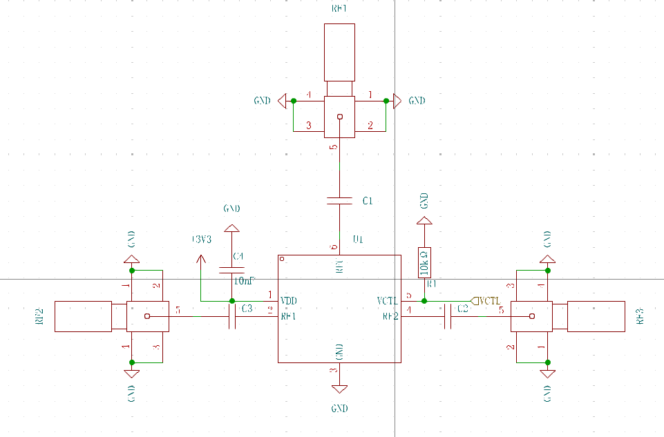
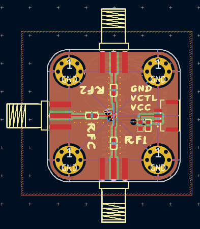
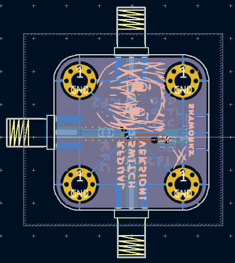

<h1>RF_DualSwitch</h1>

**SKY13453-385LF**是一款0.01至6.0 GHz单控制SPDT射频开关芯片，专为蜂窝和WLAN系统中的信号路径切换设计。其特点包括采用先进半导体工艺，在2.0 GHz下实现低至0.40 dB的插入损耗和高于25 dB的隔离度。该器件通过单一控制引脚（VCTL）即可实现RFC端口与RF1或RF2之间的高线性切换，并集成在超小尺寸的6引脚QFN（1×1 mm）封装内，满足现代紧凑型射频前端模组的需求。主要应用于手机预功率放大器（PA）模式切换s及双频WLAN（802.11a/b/g/n）等场景。

### 硬件设计

  
 
图1 RF_DualSwitch 模块示意图

SKY13453-385LF 的设计重点在于确保射频性能与控制稳定性：**控制端 VCTL** 必须严格遵循逻辑真值表，高电平范围为 +1.8V 至 +3.0V，低电平为 0V 至 +0.45V；**所有射频端口（RFC、RF1、RF2）必须串联 DC 阻隔电容**（建议 10 nF 用于低频应用）；**PCB 布局**应确保射频走线短直、阻抗控制在 50Ω，并**将芯片底部接地焊盘通过多个过孔充分连接至系统地平面**，以优化散热与电气性能；**工作温度范围**为 -40°C 至 +90°C，且在整个生产与操作过程中**必须实施严格的 ESD 防护措施**。建议使用官方评估板进行前期验证，并确保输入功率不超过 +33 dBm。

   
 
图2 RF_DualSwitch PCB 设计示例

    
PCB尺寸示意图

    

      
30 × 30 mm

    

    
边长：30 mm

    
正方形 PCB

  

  

    

      
安装孔半径

      
3mm

    

    

      
安装孔数量

      
4

    

    

      
板厚

      
1.6 mm

    

    

      
安装孔位置

      
四角对称

    

### 使用注意

- **控制逻辑与电压**：控制引脚 VCTL 必须严格遵循逻辑真值表，高电平为 +1.8V 至 +3.0V，低电平为 0V 至 +0.45V，未定义的逻辑状态会导致开关进入不确定状态
- **射频端口 DC 隔离电容**：所有射频端口（RFC、RF1、RF2）必须串联隔直电容，建议使用 10 nF 电容用于低频应用（＜100 MHz），并应选用 NPO/C0G 材质，尽量靠近芯片引脚布局
- **散热与功率**：射频输入功率绝对不得超过 +33 dBm，芯片底部裸露焊盘必须通过多个过孔大面积连接到 PCB 接地层，以确保散热和电气性能稳定

### 附录: 电容选择建议

| 射频端口                       | 频率范围                   | 推荐电容值 (C_BL) | 关键设计说明                                                 |
| :----------------------------- | :------------------------- | :---------------- | :----------------------------------------------------------- |
| **所有RF端口** (RFC, RF1, RF2) | **< 100 MHz** (低频应用)   | **≥ 10 nF**       | **数据手册推荐值**。应选用 **NPO/C0G** 材质多层陶瓷电容（MLCC），以提供充分的DC隔离。 |
|                                | **≥ 100 MHz** (中高频应用) | **100 pF**        | **典型建议值**。为获得更宽频带性能，可根据具体应用调整容值（如47 pF至220 pF）。电容的ESR和自谐振频率需满足应用要求。 |
| **控制电压 VCTL**              | **全频率范围**             | **10 nF**         | **推荐使用**。用于控制引脚的去耦与滤波，确保控制信号稳定，应靠近引脚布局。 |

> **注**：对于高频应用（如 2.4/5.8 GHz WLAN），建议参考官方评估板设计或使用网络分析仪进行实际调测，以优化电容选择。
