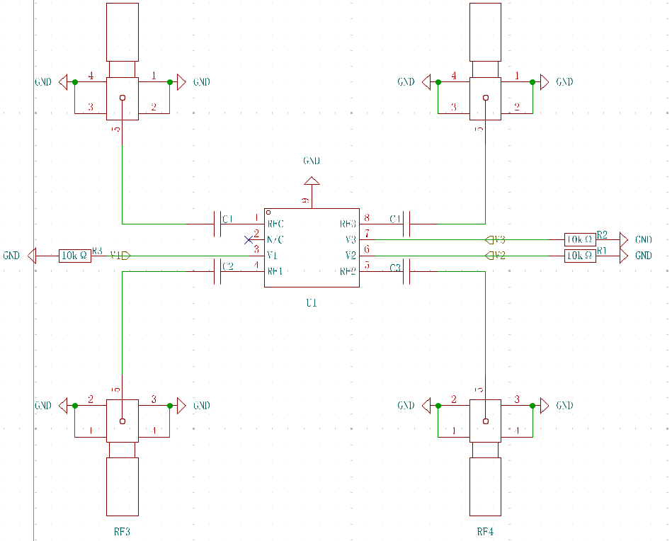
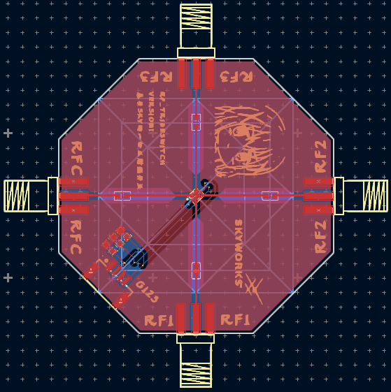
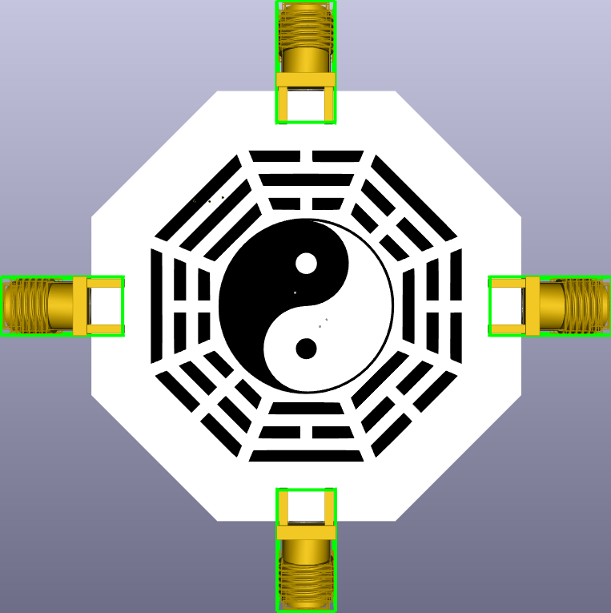

<h1>RF_TribeSwitch</h1>

**SKY13317-373LF**是一款20 MHz至6.0 GHz基于pHEMT工艺的GaAs SP3T天线开关，适用于高频宽带的无线通信系统。其采用正电压控制逻辑（0/1.8-5.0V），在2.5 GHz和6 GHz频点分别实现0.5 dB和0.9 dB的低插入损耗，并保持高达25 dB的通道隔离。芯片集成了高线性度设计（P1dB达+29 dBm），并采用微型8引脚MLP（1.5×1.5 mm）封装，是WLAN（802.11a/b/g/n）及蓝牙天线切换的理想选择。

### 硬件设计

  

图2 Dual-OutputLDO PCB设计

SKY13317-373LF的设计要求核心在于确保其射频性能与可靠性：**控制端**需严格遵循真值表逻辑，提供1.8-5.0V（高电平）与0-0.25V（低电平）的电压；**所有RF端口（RF1/RF2/RF3/RFC）必须串联DC阻隔电容**（根据频段选择47pF至10nF）；**PCB布局**须保证射频走线短直、阻抗匹配为50Ω，并**将芯片底部裸露焊盘充分接地**以优化散热与电气性能；**工作环境**需控制在-40°C至+100°C之间，且在整个生产与操作过程中**必须实施严格的ESD防护措施**。建议使用官方评估板进行前期验证，并确保输入功率不超过+30dBm。

  
  

图2 Dual-OutputLDO PCB设计

    
正八边形尺寸示意图

    

        <svg width="180" height="180" viewBox="0 0 180 180">
            <!-- 正八边形 -->
            <polygon points="90,20 130,40 150,80 130,120 90,140 50,120 30,80 50,40" 
                     style="fill: #e8f0fe; stroke: #2c5aa0; stroke-width: 3;"/>
            <!-- 边长标注 -->
            <line x1="90" y1="20" x2="130" y2="40" 
                  style="stroke: #666; stroke-width: 1; stroke-dasharray: 5,5;"/>
            <text x="110" y="15" text-anchor="middle" style="font-size: 12px; fill: #333;">20 mm</text>
            <!-- 中心点 -->
            <circle cx="90" cy="80" r="4" fill="#2c5aa0"/>
            <text x="90" y="75" text-anchor="middle" style="font-size: 10px; fill: #2c5aa0;">中心</text>
        </svg>
    

    
边长：20 mm

    
边数：8 | 内角：135° | 外角：45°

  

    

      
安装孔半径

      
无

    

    

      
安装孔数量

      
无

    

    

      
板厚

      
1.6 mm

    

    

      
安装孔位置

      
无

    

### 使用注意

- **控制逻辑与电压**：控制引脚 V1、V2、V3 必须严格遵循真值表逻辑，高电平为 +1.8V 至 +5.0V，低电平为 0V 至 +0.25V（建议为 0V），任何未定义的逻辑组合都会使开关进入不可预测的状态
- **射频端口 DC 隔离电容**：所有射频端口（RFC、RF1、RF2、RF3）必须串联隔直电容，电容值根据工作频率选择：＞500MHz 时建议 47pF，50MHz‑500MHz 建议 220pF，＜50MHz 建议 ≥10nF，并应选用 NPO/C0G 材质，且尽量靠近引脚布局
- **散热与功率**：射频输入功率绝对不得超过 +30dBm（1W），芯片底部裸露焊盘必须通过多个过孔大面积连接到 PCB 接地层，以确保散热和电气性能稳定

### 附录:建议匹配电容

| 射频端口                            | 频率范围                               | 推荐电容值 (C_BL) | 关键设计说明                                                 |
| :---------------------------------- | :------------------------------------- | :---------------- | :----------------------------------------------------------- |
| **所有RF端口** (RF1, RF2, RF3, RFC) | **> 500 MHz** (例如：2.4/5.8 GHz WLAN) | **47 pF**         | **首选值**。应选用高频性能优异的 **NPO/C0G** 材质多层陶瓷电容（MLCC），以最小化插入损耗。 |
|                                     | **50 MHz 至 500 MHz**                  | **220 pF**        | 用于中频段，确保良好的射频导通与DC隔离。                     |
|                                     | **< 50 MHz** (低频应用)                | **≥ 10 nF**       | 为获得更低的截止频率，建议使用更大容值（如10 nF）。电容的ESR和自谐振频率需满足应用要求。 |